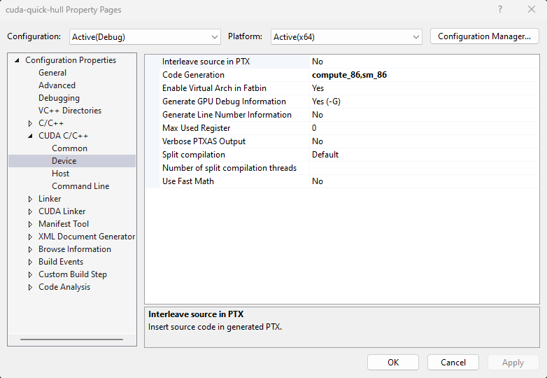
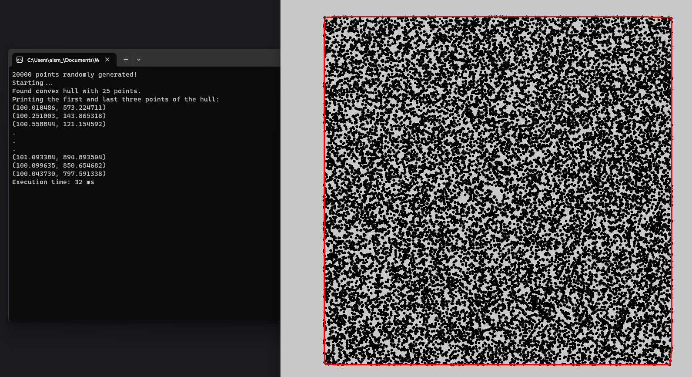

### cuda-quick-hull
# Parallelization of Convex Hull Algorithm on GPU

# Running the project
* Install CUDA 12.X along with Visual Studio 2022
* Once the project is open right click the `cuda-quick-hull` solution and select properties
* Under `Configuration Properties` -> `CUDA C/C++` -> `Device` -> `Code Generation` make sure your parameters are adjusted to your specific GPU configuration, otherwise some methods might not be recognized.

    

 * Build the project and run

    